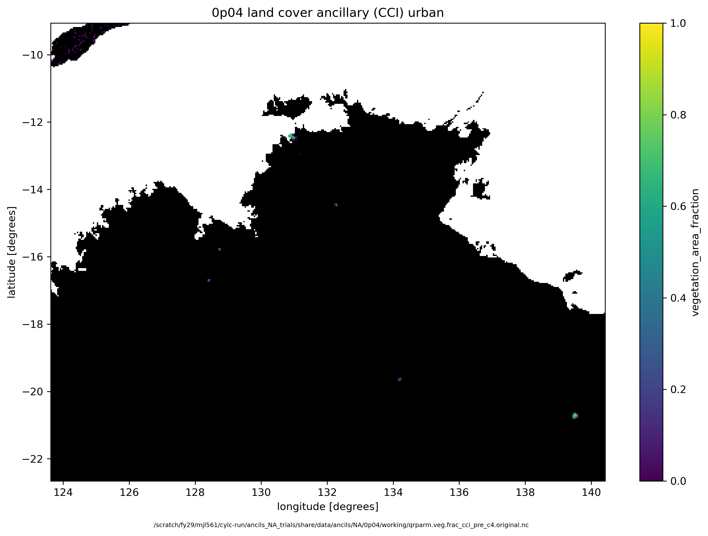
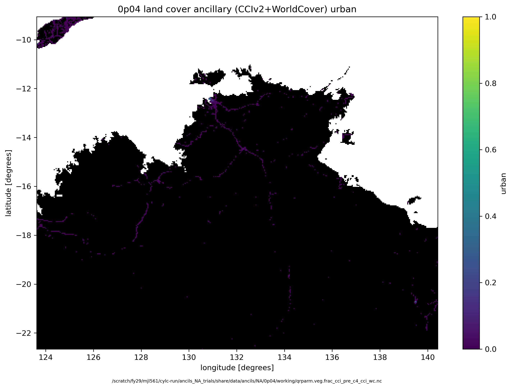

# RNS_NA_trials
Assess rainfall changes from land cover in Northern Australia (NA)

## Contributions

 - Mathew Lipson: documentation, experiment design, running experiments, ancillary generation, analysis
 - Emma Howard: concept, experiment design, analysis

# Domains

## Orig CCI landcover

## Updated CCIv2 landcover

