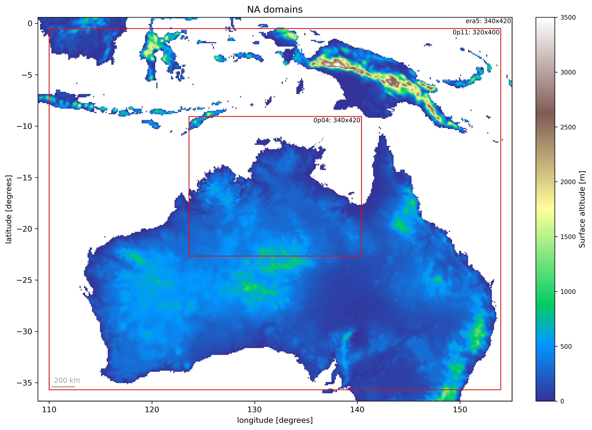

# RNS_NA_trials
Assess how monsoon rainfall is affected by changes in surface roughness.

## Contributions

- Mathew Lipson: documentation, experiment design, running experiments, ancillary generation, analysis
- Emma Howard: concept, experiment design, analysis

# Setup

**Model**: ACCESS-rAM (with OSTIA varying sea surface temperature)  
**Model suite**: https://code.metoffice.gov.uk/trac/roses-u/browser/d/g/7/6/8/rns_ostia_NA  
**Period**: 3 months (Dec 2019 - Feb 2020)  
**Nests**:  

1. GAL9 at 12.2km (BARRA-R2 initialised)  
2. RAL3p2 at 4.4km  

**Experiments**:  
 
 1. normal CCIv2 land cover
 2. modified CCIv2 land cover where roughness of grass PFTs is increased to match tree roughness to assess impacts on monsoon rain 

# Domains



Code to plot: [ancils/plot_domains.py](ancils/plot_domains.py).

# Compute

All tasks, including 2 experiments: 735 SU / day or ~66 KSU for 3 months
1 x RAL3p2 forecast task: 240 SU / day or ~22 KSU

## Instructions to run:

See [ancils README](ancils/README.md) if they need creation, then to run experiments:

```
svn co https://code.metoffice.gov.uk/svn/roses-u/d/g/7/6/8/rns_ostia_NA
cd rns_ostia_NA
rose suite-run
```

## Analysis

1. [Rainfall, wind speed, moisture convergence](experiment_analysis.md)


