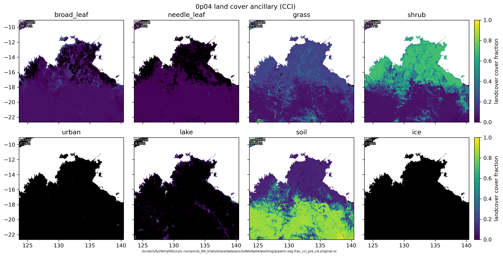
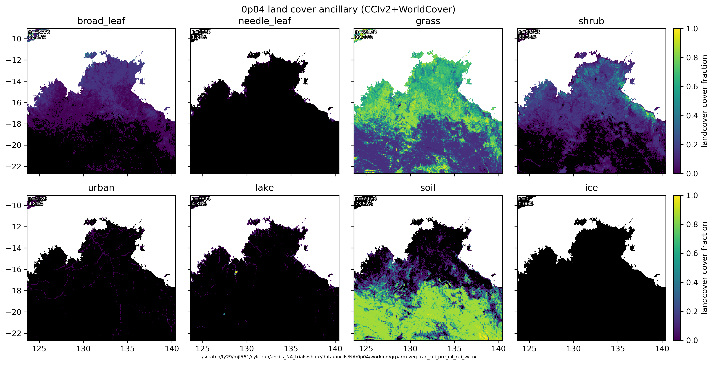

This describes the ancil generation process. 

These are Northern Australia trials with CCIv2 landcover, per ACCESS-A (but without changing mask).

## Orig CCI landcover



## Updated CCIv2 landcover



## Steps to produce

1. run u-dg767 with optional file in roses/u-dg767/opt folder, e.g.:

`rose suite-run -O rns_NA_trials --name=ancils_NA_trials` 

2. While running, in GUI 'hold' the tasks for:

- NA_0p11_ancil_lct_postproc_c4
- NA_0p04_ancil_lct_postproc_c4

3. After both these tasks are reached, run:

`qsub run_update_lct.sh`

4. Once completed without error, 'release' the held tasks in the GUI.

5. Allow to complete, and if desired plot domains with:

```
module use /g/data/xp65/public/modules;module load conda/analysis3
python plot_domains.py
```

6. Domain plots will be in 

- `cylc-run/ancils_NA_trials/share/data/ancils`  
Difference of CCI->CCIv2 will be in:  
- `/scratch/fy29/mjl561/cylc-run/ancils_NA_trials/share/data/ancils/NA/0p11/working`  
- `/scratch/fy29/mjl561/cylc-run/ancils_NA_trials/share/data/ancils/NA/0p04/working`  
