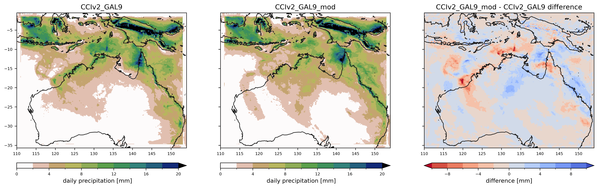
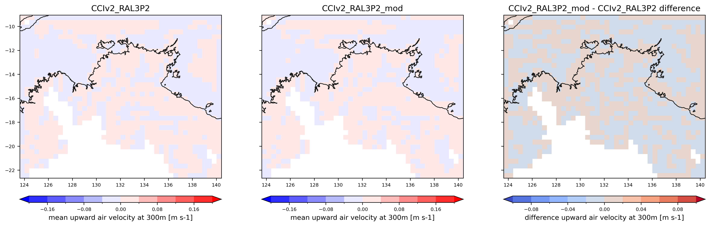

## Roughness experiment

Comparing standard (CCIv2) with modified (CCIv2_mod) over 3 month summer period: Dec 2019 - Feb 2020

The only difference between them is that CCIv2_mod has c3/c4 grass roughness increased to match tree roughness:

**GAL9**
```
diff rns_ostia_NA/app/um/opt/rose-app-GAL9.conf rns_ostia_NA/app/um/opt/rose-app-expt1.conf

< z0v_io=1.1,1.1,0.22,0.22,1.0
---
> z0v_io=1.1,1.1,1.1,1.1,1.0
```

**RAL3P2**
```
diff rns_ostia_NA/app/um/opt/rose-app-ral3p2.conf rns_ostia_NA/app/um/opt/rose-app-expt2.conf

< z0v_io=1.1,1.1,0.1,0.1,0.4
---
> z0v_io=1.1,1.1,1.1,1.1,0.4

```

[Code for producing figures](plotting/plot_pp.py)  
[Experiment MOSRS repository](https://code.metoffice.gov.uk/trac/roses-u/browser/d/g/7/6/8/rns_ostia_NA)

## Domains


## Precipitation per day

**GAL9** (total_precipitation)


**RAL3p2** (stratiform_rainfall_flux)


## Moisture convergence

**GAL9**


**RAL3p2**


**RAL3p2 coarsened**


## Wind speed at 10 m

**RAL3p2**


## Upward air velocity at 300 m

**RAL3p2 coarsened** 


## Upward air velocity at 1000 m

**RAL3p2 coarsened** 


